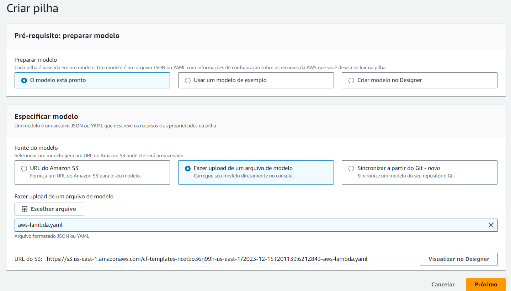
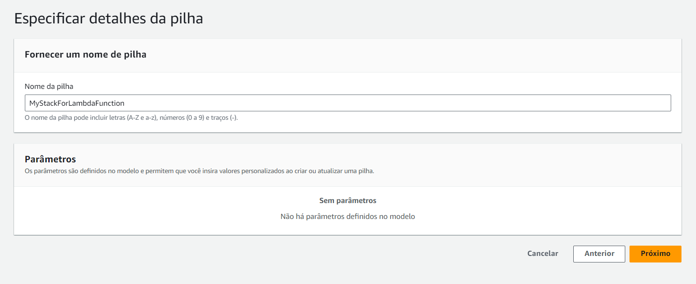
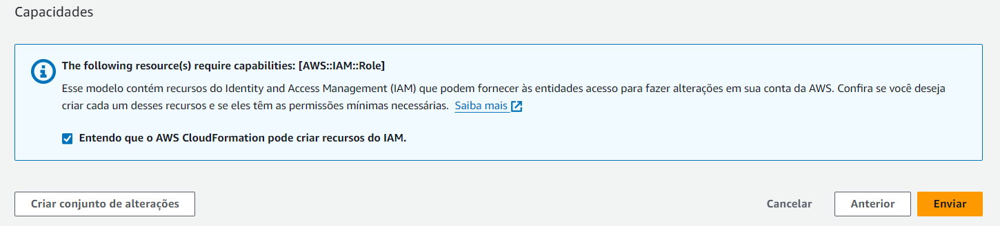
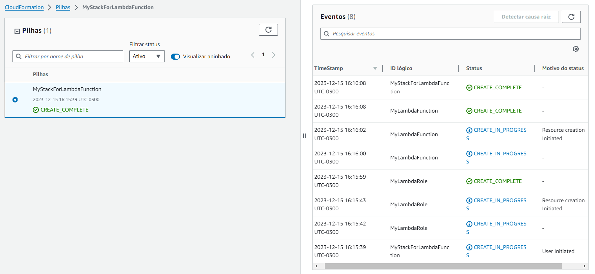
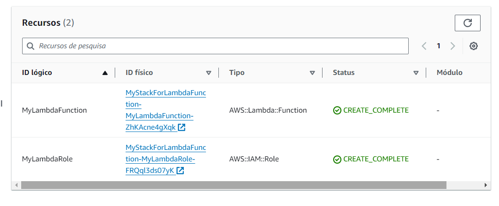

<p align="center">
  <a href="" rel="noopener">
 </a>
</p>

<h1 align="center">Criando uma pipeline no CloudFormation que faz o deploy de uma Lambda Function</h1> 
<p align="center"><i></i></p>

## 📝 Tabela de conteúdos
- [Criando arquivo YAML do Deploy da Lambda Function no Editor de Textos (Passo 1)](#step1)
- [Criando a pilha/stack no Cloudformation (Passo 2)](#step2)
- [Referências](#documentation)

## ⚙️ Criando arquivo YAML do Deploy da Lambda Function no Editor de Text (Passo 1)<a name = "step1"></a>

1. Selecione a pasta onde você deseja criar o arquivo e crie um arquivo YAML (exemplo: **aws-lambda.yaml**)
    
    - Primeiro, vamos criar a Lambda Role e em seguida criar a Lambda Function.

2. Inserindo o código YAML para criação da Lambda Role e Lambda Function

    ```yaml
    ---
    AWSTemplateFormatVersion: "2010-09-09"
    Resources:
      MyLambdaRole:
        Type: 'AWS::IAM::Role'
        Properties:
          AssumeRolePolicyDocument:
            Version: "2012-10-17"
            Statement:
              - Effect: Allow
                Principal:
                  Service:
                    - lambda.amazonaws.com
                Action:
                  - 'sts:AssumeRole'
          Path: /
          Policies:
            - PolicyName: root
              PolicyDocument:
                Version: "2012-10-17"
                Statement:
                  - Effect: Allow
                    Action: 's3:*'
                    Resource: '*'
    
      MyLambdaFunction:
        Type: AWS::Lambda::Function
        Properties:
          Role: !GetAtt MyLambdaRole.Arn
          Runtime: python3.9
          Handler: lambda.lambda_handler
          Code:
            ZipFile: |
              def lambda_handler(event, context):
                return "Hello World!"
          Tags:
            - Key: Name 
              Value: MyLambdaFunction
    ```
    
## ⚙️ Criando a pilha/stack no Cloudformation (Passo 2)<a name = "step2"></a>

1. Acesse o console da AWS, pesquise por Cloudformation e crie uma pilha.
    - Selecione "O modelo está pronto" e "Fazer upload de um arquivo de modelo".
    - Faça o upload do arquivo YAML que você criou.

    

    <br>

2. Dê um nome a pilha:

    

    <br>

3. Pule a etapa 3 e siga para a etapa 4

    - Na etapa 4, confirme a caixa de seleção antes de prosseguir com envio da pipeline.

    
    
    <br>

4. Agora se tudo ocorrer bem, serão criados os recursos especificados na pipeline.

    - Espere alguns minutos até que sejam criados os recursos.

    
    
- Recursos criados:

    

    - Caso queira testar o código lambda, clique no ID físico da Lambda Function e faça o teste
    - Talvez você encontre alguns erros ao executar o código lambda, esse código utilizado é apenas um exemplo, fique á vontade para fazer quaisquer alterações no código.

## Referências utilizadas:<a name="documentation"></a>

- [Documentação da AWS - AWS::IAM::Role - Cloudformation](https://docs.aws.amazon.com/pt_br/AWSCloudFormation/latest/UserGuide/aws-resource-iam-role.html#aws-resource-iam-role--examples)
- [Documentação da AWS - AWS::Lambda::Function - Cloudformation](https://docs.aws.amazon.com/pt_br/AWSCloudFormation/latest/UserGuide/aws-resource-lambda-function.html#aws-resource-lambda-function--examples)
- [Create a Lambda Function using Cloudformation](https://www.youtube.com/watch?v=shS3B9Obxy0)
- [Github - Lambda Template - Cloudformation](https://github.com/gauri17-pro/Cloudformation/blob/master/Lambda%20Function/aws-lambda.yaml)
